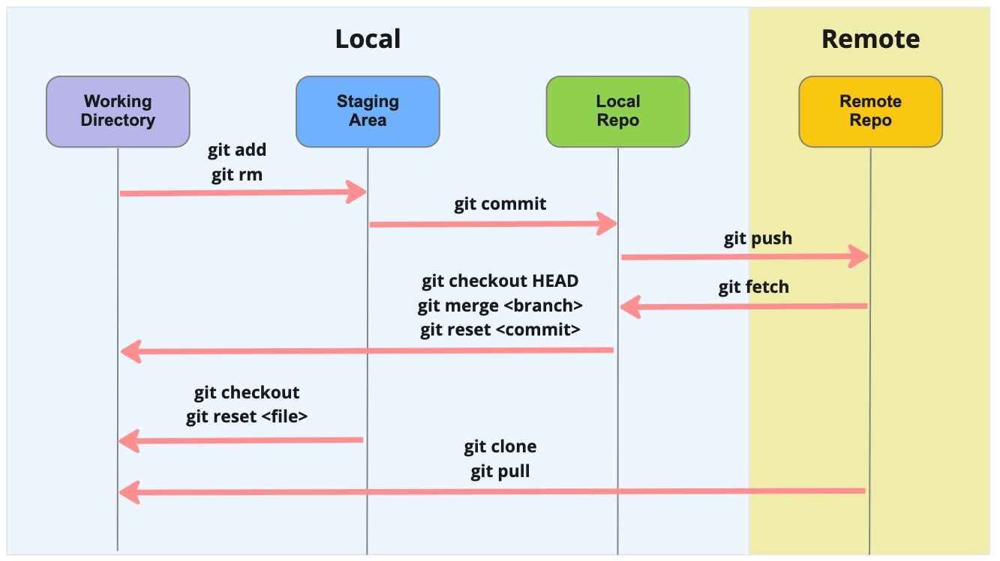

# Git Wiki

Collection of information and tips about git.

## Git Credentials

Git is purely an application. So when it interacts with the remote repo, it relies on HTTPS or SSH to transport the data and git commands to the server.

### SSH

Generate an SSH keypair to enable connection to a git remote repo via ssh.

1. generate ssh key using the RSA algorithm.

   ```shell
   # Generate a 4096-bit SSH keypair.
   [ -f ~/.ssh/id_rsa ] && [ -f ~/.ssh/id_rsa.pub ] && echo "ssh key exists" || ssh-keygen -b 4096 -t rsa -C "me@example.com"
   ```

   To generate ssh key using the ed25519 algorithm.

   ```shell
   # Generate ed25519 SSH keypair.
   [ -f ~/.ssh/id_ed25519 ] && [ -f ~/.ssh/id_ed25519.pub ] && echo "ssh key exists" || ssh-keygen -o -a 100 -t ed25519 -f ~/.ssh/id_ed25519 -C "me@example.com"
   ```

1. We will be asked to enter a passphrase during the generation of ssh keys. Please enter one to protect the ssh keys with a password - we don’t want a “naked” ssh private key. 
1. If you are on the Mac, you need to add your SSH private key and the passcode (yes, you can save your SSH passcode) to the Keychain. First add the following to the ~/.ssh/config file.

   ```text
   Host *
     AddKeysToAgent yes
     UseKeychain yes
     IdentityFile ~/.ssh/id_ed25519
   ```

1. Run the following commands on your shell.

   ```shell
   eval "$(ssh-agent -s)"
   ssh-add ~/.ssh/id_ed25519
   ```

### Github Update

In Github, make the following changes

* **Emails**: Add all the email addresses that you will be using with Github. 
* **Password and authentication**: Enable Two-factor method.
* **SSH and GPG keys**: Copy the content of the ssh public key and paste it to Github. 

### Git Config

If we are using Github as our remote repo server, we want to associate our git commits with our Github accounts. So make sure we add the same email address we added to Github earlier to the local git config.

```shell
git config --global user.name "First Lastname"
git config --global user.email "me@example.com"
```

## Git States

A file in git can be in any of the following 3 areas in the git process:

* Working directory, also known as untracked or unstaged.
* Staging area, also known as staged or indexed.
* Repository, also known as repo or committed. A repo can be:
  * Local
  * Remote


